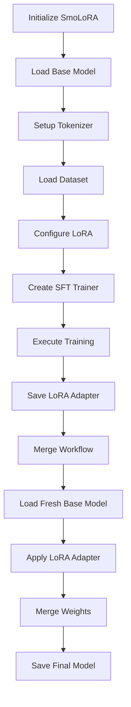
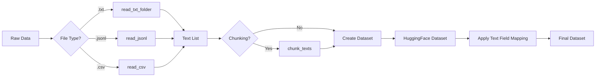
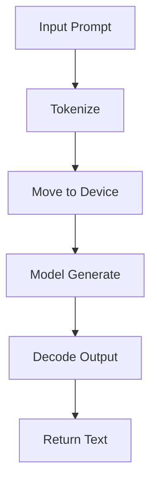

# Architecture Overview

This document provides a high-level overview of SmoLoRA's architecture, design decisions, and component interactions.

## System Architecture

SmoLoRA follows a modular architecture designed for ease of use while maintaining flexibility for advanced users.

```
┌─────────────────────────────────────────────────────────────┐
│                        SmoLoRA Core                         │
├─────────────────────────────────────────────────────────────┤
│  ┌─────────────────┐  ┌─────────────────┐  ┌──────────────┐ │
│  │   Data Layer    │  │  Training Layer │  │ Inference    │ │
│  │                 │  │                 │  │ Layer        │ │
│  │ • Dataset Prep  │  │ • LoRA Config   │  │ • Model Load │ │
│  │ • Text Loading  │  │ • SFT Training  │  │ • Text Gen   │ │
│  │ • Preprocessing │  │ • Checkpointing │  │ • Batching   │ │
│  └─────────────────┘  └─────────────────┘  └──────────────┘ │
└─────────────────────────────────────────────────────────────┘
                                │
                                ▼
┌─────────────────────────────────────────────────────────────┐
│                    External Dependencies                    │
├─────────────────────────────────────────────────────────────┤
│  HuggingFace        PEFT Library       PyTorch              │
│  • Transformers     • LoRA Adapters    • Device Mgmt       │
│  • Datasets         • Model Merging    • Memory Mgmt       │
│  • Tokenizers       • Config Mgmt      • Tensor Ops        │
└─────────────────────────────────────────────────────────────┘
```

## Design Principles

### 1. Simplicity First
- **Single Class Interface**: The main `SmoLoRA` class handles the entire workflow
- **Sensible Defaults**: All parameters have reasonable defaults for quick prototyping
- **Minimal Configuration**: Only essential parameters required for basic usage

### 2. Modularity
- **Separate Concerns**: Dataset preparation, training, and inference are distinct phases
- **Pluggable Components**: Users can override datasets, configurations, and models
- **Clean Interfaces**: Each module has well-defined inputs and outputs

### 3. Memory Efficiency
- **Lazy Loading**: Models loaded only when needed
- **Cache Management**: Automatic GPU memory cleanup after training
- **Resource Cleanup**: Explicit memory management between training phases

### 4. Device Agnostic
- **Automatic Detection**: Prefers MPS on macOS, falls back to CPU
- **Consistent Interface**: Same API regardless of underlying device
- **Performance Optimization**: Leverages available hardware acceleration

## Component Interactions

### Training Flow



### Data Processing Flow



### Inference Flow



## Key Architectural Decisions

### 1. HuggingFace Ecosystem Integration

**Decision**: Build on top of HuggingFace Transformers, Datasets, and PEFT libraries.

**Rationale**:
- Industry standard for language model fine-tuning
- Extensive model support and community
- Battle-tested implementations
- Consistent APIs across models

**Trade-offs**:
- ✅ Comprehensive model support
- ✅ Well-documented APIs
- ✅ Active community and updates
- ❌ Heavy dependency chain
- ❌ Less control over low-level operations

### 2. LoRA-Only Fine-Tuning

**Decision**: Focus exclusively on LoRA (Low-Rank Adaptation) for fine-tuning.

**Rationale**:
- Parameter-efficient: Only 1-2% of parameters trained
- Memory efficient: Fits on consumer hardware
- Fast training: Shorter training times
- Reversible: Can easily revert to base model

**Trade-offs**:
- ✅ Low resource requirements
- ✅ Fast iteration cycles
- ✅ Easy to experiment with
- ❌ May not capture complex domain adaptations
- ❌ Limited compared to full fine-tuning

### 3. Merge-Based Model Persistence

**Decision**: Merge LoRA adapters into base model for final deployment.

**Rationale**:
- Eliminates runtime adapter overhead
- Simplifies deployment and inference
- Provides standard model format
- Enables broader compatibility

**Trade-offs**:
- ✅ Standard model format
- ✅ No runtime adapter overhead
- ✅ Simplified deployment
- ❌ Larger disk space usage
- ❌ Cannot easily switch between adapters

### 4. Automatic Device Management

**Decision**: Automatically detect and use the best available device.

**Rationale**:
- Reduces configuration burden on users
- Optimizes performance automatically
- Consistent behavior across platforms
- Graceful fallbacks for compatibility

**Implementation**:
```python
self.device = torch.device("mps" if torch.backends.mps.is_available() else "cpu")
```

### 5. In-Memory Dataset Processing

**Decision**: Load and process entire datasets in memory.

**Rationale**:
- Simplifies data pipeline
- Fast access during training
- Compatible with HuggingFace Datasets
- Suitable for small-to-medium datasets

**Trade-offs**:
- ✅ Simple implementation
- ✅ Fast data access
- ✅ No disk I/O during training
- ❌ Memory limitations for large datasets
- ❌ No streaming support

## Extension Points

The architecture provides several extension points for advanced users:

### 1. Custom Dataset Sources
```python
# Override dataset after initialization
trainer = SmoLoRA(base_model, "dummy_dataset")
trainer.dataset = your_custom_dataset
```

### 2. Training Configuration
```python
# Modify training parameters
trainer.sft_config.learning_rate = 1e-4
trainer.sft_config.max_steps = 1000
```

### 3. LoRA Configuration
```python
# Adjust LoRA parameters
trainer.peft_config.r = 16
trainer.peft_config.target_modules = ["q_proj", "k_proj", "v_proj"]
```

### 4. Model Selection
```python
# Use different base models
trainer = SmoLoRA("meta-llama/Llama-2-7b-hf", dataset)
```

## Performance Characteristics

### Memory Usage

| Component | Memory Impact | Notes |
|-----------|---------------|-------|
| Base Model | ~2-14GB | Depends on model size |
| LoRA Adapter | ~10-100MB | Much smaller than base |
| Dataset | ~100MB-1GB | Depends on dataset size |
| Training | +20-50% | Additional for gradients/optimizer |

### Training Speed

| Model Size | Steps/sec | Time for 500 steps |
|------------|-----------|-------------------|
| Phi-1.5 (1.3B) | 2-3 | ~3-4 minutes |
| Llama-2-7B | 0.5-1 | ~8-15 minutes |

*Note: Performance varies by hardware and dataset complexity*

### Disk Usage

| Component | Size | Notes |
|-----------|------|-------|
| Base Model | 2-14GB | Downloaded once, cached |
| LoRA Adapter | 10-100MB | Checkpoint during training |
| Merged Model | 2-14GB | Final output for deployment |

## Scalability Considerations

### Current Limitations

1. **Single GPU**: No distributed training support
2. **Memory Bound**: Limited by available RAM/VRAM
3. **Synchronous**: No async/streaming inference
4. **No Quantization**: No built-in model compression

### Future Extension Possibilities

1. **Multi-GPU Training**: Distribute across multiple devices
2. **Streaming Datasets**: Handle datasets larger than memory
3. **Model Quantization**: Reduce memory usage with INT8/FP16
4. **Batch Inference**: Process multiple requests efficiently
5. **Checkpoint Resume**: Resume training from interruptions

## Error Handling Strategy

### Defensive Programming
- Input validation at boundaries
- Graceful fallbacks for device issues
- Clear error messages with resolution hints

### Resource Management
- Automatic cleanup of GPU memory
- Explicit deletion of large objects
- Safe file operations with proper exception handling

### User Feedback
- Progress logging with timestamps
- Clear indication of training phases
- Informative error messages with suggested fixes

This architecture balances simplicity with flexibility, making SmoLoRA accessible to beginners while providing extension points for advanced users.
