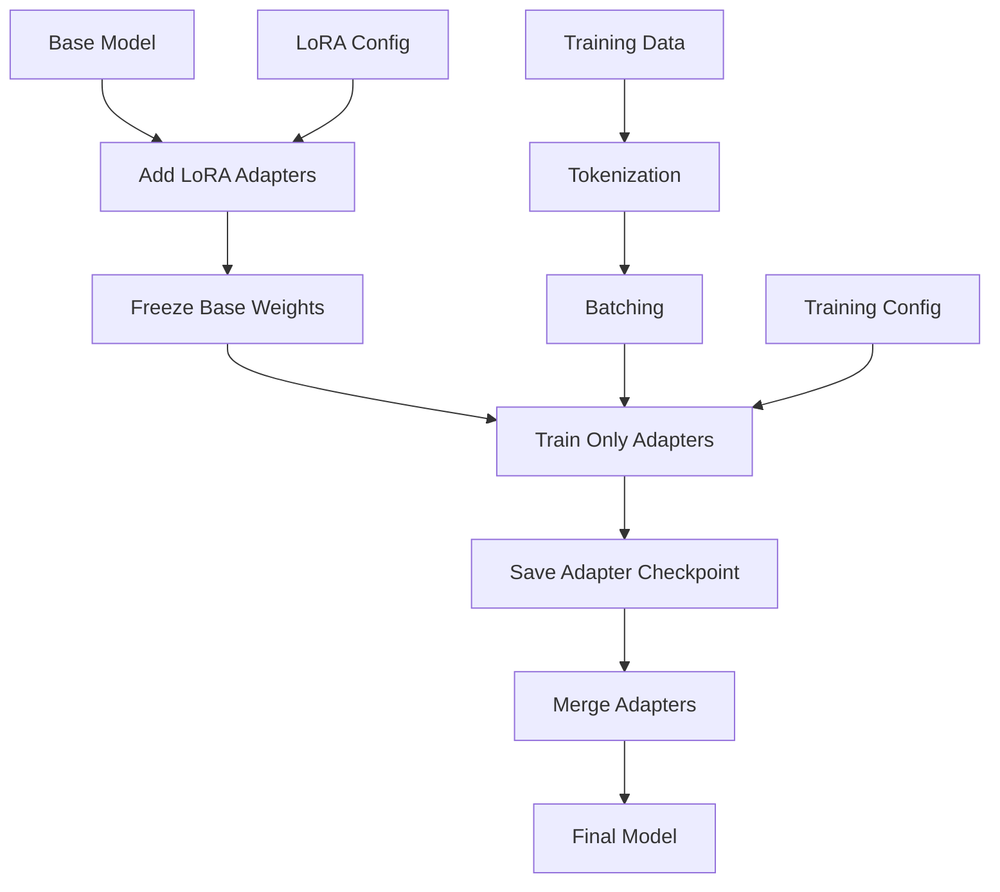

# Training Pipeline

This document provides an in-depth explanation of SmoLoRA's training process, from initialization through final model merging.

## Training Overview

SmoLoRA implements Parameter Efficient Fine-Tuning (PEFT) using LoRA (Low-Rank Adaptation) to fine-tune large language models with minimal computational resources. The training pipeline consists of several carefully orchestrated phases.

## Training Architecture



## Phase 1: Training Setup

### LoRA Configuration

The training process begins with LoRA configuration setup:

```python
self.peft_config = LoraConfig(
    r=8,                          # Rank of adaptation matrices
    lora_alpha=16,               # Scaling parameter (α)
    lora_dropout=0.1,            # Dropout for regularization
    bias="none",                 # Bias parameter strategy
    task_type="CAUSAL_LM",       # Task type identifier
    target_modules=["q_proj", "v_proj"]  # Which modules to adapt
)
```

#### Parameter Deep Dive

**Rank (r)**: Controls the dimensionality of the low-rank matrices.
- **Lower r (4-8)**: Fewer parameters, faster training, less capacity
- **Higher r (16-64)**: More parameters, slower training, more capacity
- **Sweet spot**: r=8 for most general tasks

**Alpha (α)**: Scaling factor for adapter contributions.
- **Formula**: `adapter_output = (α/r) * adapter_weights`
- **Typical values**: 16-32 (usually 2× the rank)
- **Effect**: Higher α increases adapter influence

**Target Modules**: Which attention layers to adapt.
- **Query/Value**: Most common choice, affects attention patterns
- **Key/Query**: Alternative for different adaptation strategies
- **All projections**: Maximum capacity but more parameters

#### Mathematical Foundation

LoRA decomposes weight updates as low-rank matrices:

```
W' = W + (α/r) * A * B
```

Where:
- `W`: Original weight matrix (frozen)
- `A`: Low-rank matrix (r × d)
- `B`: Low-rank matrix (d × r)
- `W'`: Effective adapted weight

### Training Configuration

```python
self.sft_config = SFTConfig(
    output_dir=self.output_dir,
    per_device_train_batch_size=1,      # Memory-conservative
    gradient_accumulation_steps=8,       # Effective batch size = 8
    learning_rate=2e-4,                 # LoRA-specific learning rate
    max_steps=500,                      # Quick iteration cycles
    logging_steps=10,                   # Progress monitoring
    optim="adamw_torch",                # Stable optimizer
    fp16=False,                         # Full precision
    bf16=False,                         # No bfloat16
    max_length=1024,                    # Token sequence limit
    dataset_text_field="text"           # Input field name
)
```

#### Parameter Rationale

**Batch Size Strategy**:
- Small `per_device_train_batch_size` (1) conserves memory
- `gradient_accumulation_steps` (8) simulates larger batches
- Effective batch size = 1 × 8 = 8 examples per gradient update

**Learning Rate**:
- LoRA typically uses higher learning rates than full fine-tuning
- 2e-4 is conservative but stable
- Can be increased to 5e-4 or 1e-3 for faster adaptation

**Training Steps**:
- 500 steps provides quick feedback for experimentation
- Increase to 1000-2000 for production models
- Monitor validation loss to prevent overfitting

## Phase 2: Training Execution

### Training Loop Initialization

```python
self.trainer = SFTTrainer(
    model=self.model,
    train_dataset=self.dataset,
    peft_config=self.peft_config,
    args=self.sft_config
)
```

The SFTTrainer handles:
- **Model wrapping**: Applies LoRA adapters to specified modules
- **Parameter freezing**: Ensures only adapter weights are trainable
- **Data loading**: Creates efficient data loaders
- **Optimization setup**: Initializes optimizer for adapter parameters only

### Parameter Analysis

After setup, the model has two types of parameters:

```python
# Check trainable parameters
def print_trainable_parameters(model):
    trainable_params = 0
    all_param = 0
    for _, param in model.named_parameters():
        all_param += param.numel()
        if param.requires_grad:
            trainable_params += param.numel()

    print(f"Trainable params: {trainable_params:,}")
    print(f"All params: {all_param:,}")
    print(f"Trainable %: {100 * trainable_params / all_param:.2f}")

# Typical output for 1.3B parameter model with LoRA:
# Trainable params: 2,097,152
# All params: 1,300,000,000
# Trainable %: 0.16
```

### Training Process

When `trainer.train()` is called, the following occurs:

#### 1. Data Processing
```python
# For each batch:
inputs = tokenizer(batch_texts, return_tensors="pt", padding=True, truncation=True)
input_ids = inputs["input_ids"]
attention_mask = inputs["attention_mask"]
labels = input_ids.clone()  # For causal LM, labels = inputs
```

#### 2. Forward Pass
```python
# Simplified forward pass logic:
outputs = model(
    input_ids=input_ids,
    attention_mask=attention_mask,
    labels=labels
)
loss = outputs.loss
```

**LoRA Forward Pass**:
1. Input passes through base model layers (frozen)
2. At target modules, adapter contributions are added:
   ```python
   adapted_output = base_output + (alpha/r) * adapter_B(adapter_A(input))
   ```
3. Loss computed on next-token prediction

#### 3. Backward Pass
```python
loss.backward()  # Gradients computed only for adapter parameters
```

**Gradient Flow**:
- Base model parameters: `requires_grad=False` (no gradients)
- Adapter parameters: `requires_grad=True` (receive gradients)
- Memory efficient: Only adapter gradients stored

#### 4. Optimization Step
```python
if (step + 1) % gradient_accumulation_steps == 0:
    optimizer.step()    # Update only adapter weights
    optimizer.zero_grad()
```

### Training Monitoring

During training, the system logs:

```
[2024-06-06 10:15:00] Starting training...
{'loss': 2.843, 'learning_rate': 0.0002, 'epoch': 0.02}
{'loss': 2.721, 'learning_rate': 0.0002, 'epoch': 0.04}
{'loss': 2.654, 'learning_rate': 0.0002, 'epoch': 0.06}
...
[2024-06-06 10:18:00] Training finished.
```

**Key Metrics**:
- **Loss**: Decreasing indicates learning
- **Learning Rate**: Should remain stable
- **Epoch**: Progress through dataset

## Phase 3: Checkpoint Saving

### Adapter Checkpoint Creation

```python
adapter_ckpt = os.path.join(self.output_dir, "adapter_checkpoint")
self.trainer.model.save_pretrained(adapter_ckpt)
self.adapter_checkpoint = adapter_ckpt
```

**What's Saved**:
- LoRA adapter weights (A and B matrices)
- LoRA configuration (rank, alpha, target modules)
- Adapter metadata

**Checkpoint Structure**:
```
adapter_checkpoint/
├── adapter_config.json     # LoRA configuration
├── adapter_model.bin       # Adapter weights (PyTorch)
└── adapter_model.safetensors  # Adapter weights (SafeTensors)
```

**File Sizes**:
- Adapter weights: ~10-100MB (vs. 2-14GB for full model)
- Fast to save and load
- Easy to share and version

## Phase 4: Model Merging

The merging phase combines adapter weights with the base model to create a standalone model.

### Memory Management

```python
# Clear training artifacts
del self.model
del self.trainer
torch.mps.empty_cache()  # Clear GPU memory
```

**Why This Is Necessary**:
- Training keeps gradients, optimizer states in memory
- Merging requires loading fresh base model
- Prevents out-of-memory errors

### Fresh Model Loading

```python
base_model = AutoModelForCausalLM.from_pretrained(
    self.base_model_name,
    trust_remote_code=True
).to(self.device)
base_model.config.use_cache = False
```

**Loading Fresh Model**:
- Ensures clean state without training artifacts
- Consistent starting point for merging
- Avoids potential state conflicts

### Adapter Application and Merging

```python
model_with_adapter = PeftModel.from_pretrained(base_model, self.adapter_checkpoint)
merged_model = model_with_adapter.merge_and_unload()
```

#### Technical Deep Dive

**PeftModel.from_pretrained()** process:
1. Loads adapter configuration
2. Applies adapters to specified modules
3. Loads adapter weights from checkpoint

**merge_and_unload()** process:
1. For each adapted module:
   ```python
   # Mathematical merging
   original_weight = module.weight.data
   adapter_A = adapter.lora_A.weight
   adapter_B = adapter.lora_B.weight
   adapter_scale = adapter.scaling

   # Merge: W' = W + scale * B @ A
   merged_weight = original_weight + adapter_scale * (adapter_B @ adapter_A)
   module.weight.data = merged_weight
   ```
2. Removes adapter layers
3. Returns standard PyTorch model

### Final Model Saving

```python
merged_model_path = os.path.join(self.output_dir, "final_merged")
merged_model.save_pretrained(merged_model_path)
self.tokenizer.save_pretrained(merged_model_path)
```

**Output Structure**:
```
final_merged/
├── config.json              # Model configuration
├── generation_config.json   # Generation parameters
├── pytorch_model.bin        # Model weights
├── tokenizer.json          # Tokenizer
├── tokenizer_config.json   # Tokenizer config
└── special_tokens_map.json # Special tokens
```

## Training Best Practices

### Hyperparameter Tuning

#### Learning Rate Scheduling
```python
# Custom learning rate schedule
sft_config.lr_scheduler_type = "cosine"
sft_config.warmup_steps = 50
```

#### Rank Selection Guidelines
```python
# Task-specific rank selection
if task == "domain_adaptation":
    r = 4  # Lower rank for simple adaptation
elif task == "style_transfer":
    r = 8  # Medium rank for moderate changes
elif task == "new_capabilities":
    r = 16  # Higher rank for complex adaptations
```

#### Target Module Selection
```python
# Conservative (faster, less capacity)
target_modules = ["q_proj", "v_proj"]

# Balanced (good performance/efficiency)
target_modules = ["q_proj", "k_proj", "v_proj"]

# Aggressive (maximum capacity)
target_modules = ["q_proj", "k_proj", "v_proj", "o_proj", "gate_proj", "up_proj", "down_proj"]
```

### Monitoring and Debugging

#### Training Diagnostics
```python
def training_diagnostics(trainer):
    """Monitor training health."""
    logs = trainer.state.log_history

    # Check for loss convergence
    recent_losses = [log['train_loss'] for log in logs[-10:] if 'train_loss' in log]
    if len(recent_losses) > 5:
        loss_trend = recent_losses[-1] - recent_losses[0]
        if loss_trend > 0:
            print("Warning: Loss increasing recently")

    # Check learning rate
    current_lr = trainer.get_last_lr()[0]
    if current_lr < 1e-6:
        print("Warning: Learning rate very low")
```

#### Memory Monitoring
```python
def memory_usage():
    """Monitor memory usage during training."""
    import psutil
    import torch

    # System memory
    system_mem = psutil.virtual_memory()
    print(f"System RAM: {system_mem.percent:.1f}% used")

    # GPU memory (if available)
    if torch.cuda.is_available():
        gpu_mem = torch.cuda.memory_allocated() / 1024**3
        print(f"GPU Memory: {gpu_mem:.1f} GB")
    elif torch.backends.mps.is_available():
        # MPS memory monitoring is limited
        print("MPS memory monitoring not available")
```

### Common Training Issues

#### 1. Overfitting
**Symptoms**: Training loss decreases but validation loss increases
**Solutions**:
- Reduce training steps
- Increase dropout
- Use smaller rank
- Add regularization

#### 2. Underfitting
**Symptoms**: Loss plateaus at high value
**Solutions**:
- Increase learning rate
- Increase rank
- Add more target modules
- Train for more steps

#### 3. Memory Issues
**Symptoms**: CUDA/MPS out of memory errors
**Solutions**:
- Reduce batch size
- Increase gradient accumulation
- Use smaller base model
- Reduce max_length

#### 4. Slow Training
**Symptoms**: Very slow steps/second
**Solutions**:
- Reduce max_length
- Use smaller dataset
- Optimize data loading
- Check device utilization

### Performance Optimization

#### Data Loading Optimization
```python
# Efficient data loading
sft_config.dataloader_num_workers = 2
sft_config.dataloader_pin_memory = True
sft_config.remove_unused_columns = False
```

#### Mixed Precision Training
```python
# Enable for compatible hardware
sft_config.fp16 = True  # For NVIDIA GPUs
# sft_config.bf16 = True  # For newer hardware
```

#### Gradient Checkpointing
```python
# Trade compute for memory
sft_config.gradient_checkpointing = True
```

## Advanced Training Techniques

### Multi-Task Training

```python
# Prepare datasets for different tasks
task1_data = prepare_dataset("task1.jsonl", text_field="text")
task2_data = prepare_dataset("task2.csv", text_field="content")

# Combine with task prefixes
def add_task_prefix(example, task_name):
    example['text'] = f"[TASK:{task_name}] {example['text']}"
    return example

task1_data = task1_data.map(lambda x: add_task_prefix(x, "SENTIMENT"))
task2_data = task2_data.map(lambda x: add_task_prefix(x, "SUMMARY"))

# Combine datasets
from datasets import concatenate_datasets
multi_task_data = concatenate_datasets([task1_data, task2_data])
```

### Curriculum Learning

```python
def curriculum_learning(dataset, difficulty_fn):
    """Sort dataset by difficulty for curriculum learning."""
    # Add difficulty scores
    dataset = dataset.map(lambda x: {**x, 'difficulty': difficulty_fn(x['text'])})

    # Sort by difficulty
    dataset = dataset.sort('difficulty')

    # Remove difficulty column
    dataset = dataset.remove_columns(['difficulty'])
    return dataset

# Example difficulty function
def text_difficulty(text):
    return len(text.split())  # Longer = harder

# Apply curriculum learning
sorted_dataset = curriculum_learning(dataset, text_difficulty)
```

### Dynamic Rank Adaptation

```python
def dynamic_rank_training():
    """Train with increasing rank over time."""
    ranks = [4, 8, 16]

    for rank in ranks:
        print(f"Training with rank {rank}")

        # Update config
        trainer.peft_config.r = rank
        trainer.peft_config.lora_alpha = rank * 2

        # Train for portion of total steps
        trainer.train(max_steps=500 // len(ranks))

        # Save intermediate checkpoint
        trainer.model.save_pretrained(f"checkpoint_r{rank}")
```

This comprehensive training pipeline provides both simplicity for basic use cases and flexibility for advanced fine-tuning scenarios.
