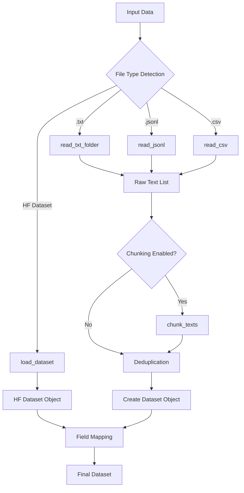

# Dataset Handling

This document provides comprehensive coverage of data loading, preprocessing, and preparation utilities in SmoLoRA.

## Overview

SmoLoRA supports multiple data input formats and provides flexible preprocessing options to handle various text datasets. The system is designed to be both simple for basic use cases and powerful for complex data preparation needs.

## Supported Data Formats

### 1. Text Files (.txt)

**Format**: Plain text files with one training example per line.

```
This is the first training example.
This is the second training example.

This is the fourth example (empty line ignored).
```

**Characteristics**:
- Simplest format to work with
- One sample per line
- Empty lines are automatically filtered out
- Suitable for simple text classification or generation tasks

**Usage Examples**:
```python
# Using local_text.py (simple)
from local_text import load_text_data
dataset = load_text_data("./my_text_files/")

# Using prepare_dataset.py (advanced)
from prepare_dataset import prepare_dataset
dataset = prepare_dataset("./my_text_files/")
```

### 2. JSONL Files (.jsonl)

**Format**: JSON Lines format with one JSON object per line.

```json
{"text": "First example", "label": "positive"}
{"text": "Second example", "label": "negative"}
{"content": "Different field name", "category": "news"}
```

**Characteristics**:
- Structured data with multiple fields
- Flexible field naming
- Can include metadata alongside text
- Streaming-friendly format

**Usage Examples**:
```python
# Default "text" field
dataset = prepare_dataset("data.jsonl")

# Custom field name
dataset = prepare_dataset("data.jsonl", text_field="content")

# Force file type if extension differs
dataset = prepare_dataset("my_data", file_type="jsonl", text_field="message")
```

### 3. CSV Files (.csv)

**Format**: Comma-separated values with header row.

```csv
text,label,category
"First example text",positive,review
"Second example text",negative,review
"Text with, embedded commas",neutral,comment
```

**Characteristics**:
- Tabular data with headers
- Handles quoted text with embedded commas
- Multiple columns for metadata
- Familiar format for many users

**Usage Examples**:
```python
# Default "text" column
dataset = prepare_dataset("data.csv")

# Custom column name
dataset = prepare_dataset("data.csv", text_field="review_text")

# With chunking
dataset = prepare_dataset("data.csv", text_field="content", chunk_size=128)
```

### 4. HuggingFace Datasets

**Format**: Any dataset available on HuggingFace Hub.

```python
# Direct usage in SmoLoRA
trainer = SmoLoRA(
    base_model_name="microsoft/Phi-1.5",
    dataset_name="yelp_review_full",  # HuggingFace dataset
    text_field="text"
)
```

**Popular Datasets**:
- `yelp_review_full`: Restaurant/business reviews
- `imdb`: Movie review sentiment
- `ag_news`: News categorization
- `squad`: Question-answering pairs
- Custom uploaded datasets

## Data Processing Pipeline

### Step-by-Step Processing



### 1. File Type Detection

The system automatically detects file types based on several criteria:

```python
def detect_file_type(source: str, file_type: Optional[str] = None) -> str:
    if file_type is not None:
        return file_type
    
    if os.path.isdir(source):
        return "txt"
    elif source.endswith(".jsonl"):
        return "jsonl"
    elif source.endswith(".csv"):
        return "csv"
    else:
        raise ValueError("Cannot infer file type. Please specify file_type.")
```

**Override Options**:
```python
# Force specific type
dataset = prepare_dataset("my_data", file_type="txt")
dataset = prepare_dataset("data.txt", file_type="jsonl")  # Ignore extension
```

### 2. Text Extraction

Each format has a specialized extraction function:

#### Text File Processing
```python
def read_txt_folder(folder_path: str) -> List[str]:
    texts = []
    for fname in os.listdir(folder_path):
        if fname.endswith(".txt"):
            with open(os.path.join(folder_path, fname), "r", encoding="utf-8") as f:
                for line in f:
                    line = line.strip()
                    if line:  # Skip empty lines
                        texts.append(line)
    return texts
```

**Behavior**:
- Processes all .txt files in directory
- Each line becomes a separate training example
- Automatic whitespace trimming
- Empty line filtering

#### JSONL Processing
```python
def read_jsonl(file_path: str, text_field: str = "text") -> List[str]:
    texts = []
    with open(file_path, "r", encoding="utf-8") as f:
        for line in f:
            try:
                obj = json.loads(line)
                if text_field in obj and obj[text_field]:
                    texts.append(obj[text_field].strip())
            except json.JSONDecodeError:
                # Skip malformed lines
                continue
    return texts
```

**Error Handling**:
- Silently skips malformed JSON
- Ignores objects missing the text field
- Filters out empty text values

#### CSV Processing
```python
def read_csv(file_path: str, text_field: str = "text") -> List[str]:
    texts = []
    with open(file_path, "r", encoding="utf-8") as f:
        reader = csv.DictReader(f)
        for row in reader:
            if text_field in row and row[text_field]:
                texts.append(row[text_field].strip())
    return texts
```

**Features**:
- Automatic header detection
- Handles quoted fields with embedded commas
- Flexible column naming
- Empty value filtering

### 3. Text Chunking

Optional text chunking breaks long documents into smaller training examples.

```python
def chunk_texts(texts: List[str], chunk_size: int = 0) -> List[str]:
    if chunk_size <= 0:
        return texts
    
    chunks = []
    for text in texts:
        words = text.split()
        for i in range(0, len(words), chunk_size):
            chunk = " ".join(words[i:i+chunk_size])
            if chunk:
                chunks.append(chunk)
    return chunks
```

**Use Cases**:

1. **Long Documents**: Break articles/books into training-sized pieces
```python
# 128-word chunks for long documents
dataset = prepare_dataset("documents.txt", chunk_size=128)
```

2. **Data Augmentation**: Create more examples from limited data
```python
# Smaller chunks = more training examples
dataset = prepare_dataset("short_texts.csv", chunk_size=32)
```

3. **Memory Management**: Keep sequences within model limits
```python
# Ensure all samples fit in model context
dataset = prepare_dataset("data.jsonl", chunk_size=256)
```

**Chunking Behavior**:
- Splits on word boundaries (preserves word integrity)
- Non-overlapping chunks
- Filters out empty chunks
- Maintains original text order

### 4. Deduplication and Cleaning

The system automatically removes duplicates and empty entries:

```python
# Remove empty texts
texts = [t for t in texts if t]

# Remove duplicates while preserving order
texts = list(dict.fromkeys(texts))
```

**Benefits**:
- Prevents training on identical examples
- Reduces dataset size
- Improves training efficiency
- Maintains deterministic ordering

### 5. Dataset Object Creation

Finally, texts are converted to HuggingFace Dataset format:

```python
data = [{"text": t} for t in texts]
return Dataset.from_list(data)
```

**Result**: Standardized dataset with "text" field, compatible with SmoLoRA training.

## Advanced Usage Patterns

### Custom Field Mapping

Handle datasets with non-standard field names:

```python
# Map different field names to "text"
dataset = prepare_dataset("reviews.jsonl", text_field="review_content")
dataset = prepare_dataset("articles.csv", text_field="body")
dataset = prepare_dataset("social.jsonl", text_field="message")
```

### Multi-Step Processing

Combine multiple data sources:

```python
# Process multiple sources
dataset1 = prepare_dataset("folder1/", chunk_size=64)
dataset2 = prepare_dataset("data.jsonl", text_field="content")
dataset3 = prepare_dataset("reviews.csv", text_field="text")

# Combine datasets (requires additional code)
from datasets import concatenate_datasets
combined = concatenate_datasets([dataset1, dataset2, dataset3])
```

### Quality Filtering

Add custom filtering logic:

```python
def filter_quality(text: str) -> bool:
    """Filter out low-quality texts."""
    return (
        len(text.split()) >= 10 and  # Minimum word count
        len(text) <= 2000 and       # Maximum character count
        not text.isupper() and      # Not all caps
        '.' in text                 # Has punctuation
    )

# Apply after prepare_dataset
dataset = prepare_dataset("data.txt")
dataset = dataset.filter(lambda example: filter_quality(example['text']))
```

### Preprocessing Hooks

Add text preprocessing:

```python
import re

def clean_text(text: str) -> str:
    """Clean and normalize text."""
    # Remove URLs
    text = re.sub(r'http\S+', '', text)
    # Remove extra whitespace
    text = re.sub(r'\s+', ' ', text)
    # Basic cleanup
    return text.strip()

# Apply cleaning
dataset = prepare_dataset("messy_data.txt")
dataset = dataset.map(lambda x: {"text": clean_text(x["text"])})
```

## Performance Considerations

### Memory Usage

Different approaches have different memory characteristics:

| Method | Memory Usage | Best For |
|--------|--------------|----------|
| `load_text_data()` | Low | Small datasets, simple use cases |
| `prepare_dataset()` | Medium | Most use cases, good balance |
| Direct HF datasets | Variable | Large datasets, existing datasets |

### Processing Speed

Optimization tips for large datasets:

1. **Use appropriate chunk_size**:
```python
# Faster processing with reasonable chunks
dataset = prepare_dataset("large_file.txt", chunk_size=100)
```

2. **Batch processing for multiple files**:
```python
# Process each file separately for better memory management
datasets = []
for file_path in file_paths:
    ds = prepare_dataset(file_path)
    datasets.append(ds)
```

3. **Streaming for very large datasets**:
```python
# For datasets that don't fit in memory
from datasets import load_dataset
dataset = load_dataset("very_large_dataset", streaming=True)
```

### Storage Efficiency

Save processed datasets for reuse:

```python
# Process once, save for later
dataset = prepare_dataset("raw_data.csv", chunk_size=64)
dataset.save_to_disk("./processed_dataset")

# Load processed dataset
from datasets import load_from_disk
dataset = load_from_disk("./processed_dataset")
```

## Common Patterns and Examples

### Pattern 1: Academic Paper Processing

```python
# Process research papers with chunking
dataset = prepare_dataset(
    "papers/",
    chunk_size=200,  # Academic writing style
    file_type="txt"
)
```

### Pattern 2: Social Media Data

```python
# Process tweets/posts
dataset = prepare_dataset(
    "social_media.jsonl",
    text_field="tweet_text",
    chunk_size=0  # Keep posts intact
)
```

### Pattern 3: Customer Reviews

```python
# Process product reviews
dataset = prepare_dataset(
    "reviews.csv",
    text_field="review_content",
    chunk_size=100  # Reasonable review length
)
```

### Pattern 4: Mixed Data Sources

```python
# Combine different data types
news_data = prepare_dataset("news.csv", text_field="article")
social_data = prepare_dataset("social.jsonl", text_field="post")
text_data = prepare_dataset("documents/")

# Custom combination logic needed
from datasets import concatenate_datasets
mixed_dataset = concatenate_datasets([news_data, social_data, text_data])
```

## Error Handling and Troubleshooting

### Common Issues

1. **File Not Found**:
```python
try:
    dataset = prepare_dataset("missing_file.txt")
except FileNotFoundError:
    print("File not found. Check the path.")
```

2. **Malformed Data**:
```python
# JSONL with some malformed lines
dataset = prepare_dataset("messy.jsonl")  # Automatically skips bad lines
print(f"Loaded {len(dataset)} valid examples")
```

3. **Memory Issues**:
```python
# Use chunking for large files
dataset = prepare_dataset("huge_file.txt", chunk_size=50)
```

4. **Encoding Issues**:
```python
# Files are read with UTF-8 by default
# For other encodings, preprocess files first
```

### Validation Helpers

```python
def validate_dataset(dataset):
    """Validate dataset quality."""
    texts = [ex['text'] for ex in dataset]
    
    print(f"Total examples: {len(texts)}")
    print(f"Average length: {sum(len(t.split()) for t in texts) / len(texts):.1f} words")
    print(f"Min length: {min(len(t.split()) for t in texts)} words")
    print(f"Max length: {max(len(t.split()) for t in texts)} words")
    
    # Check for duplicates
    unique_count = len(set(texts))
    print(f"Unique examples: {unique_count} ({unique_count/len(texts)*100:.1f}%)")

# Usage
dataset = prepare_dataset("my_data.txt")
validate_dataset(dataset)
```

This comprehensive dataset handling system provides the flexibility to work with diverse data sources while maintaining simplicity for common use cases.
