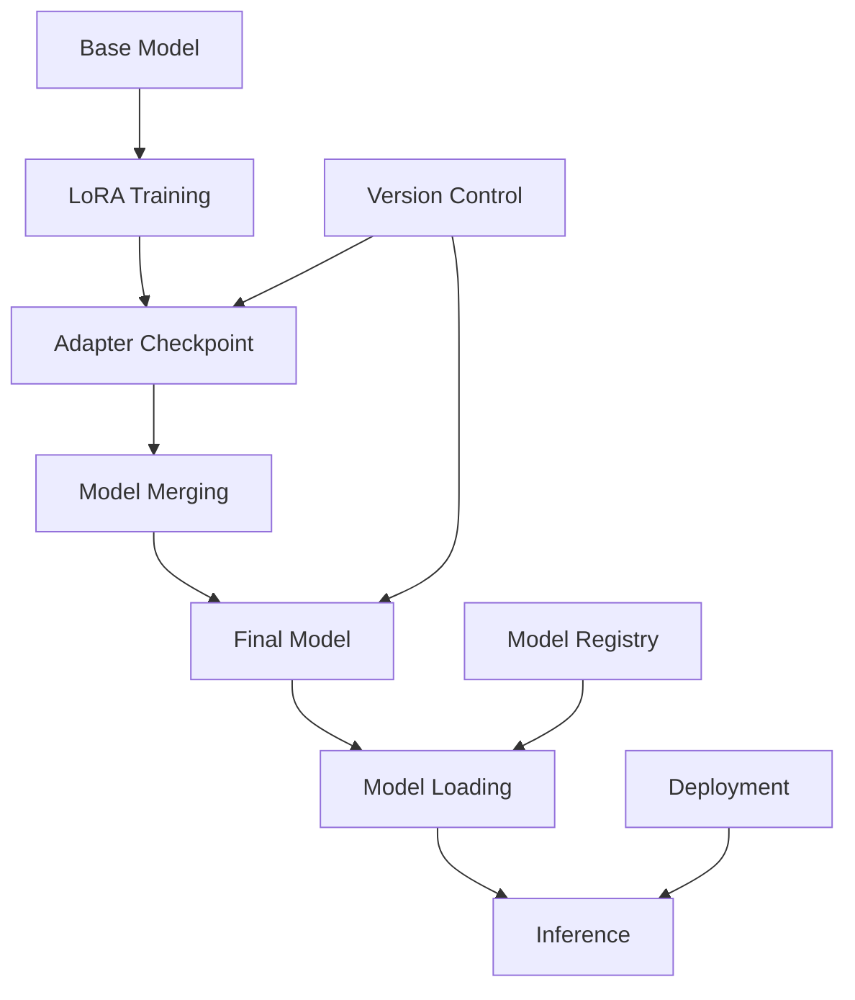

# Model Management

This document covers model loading, saving, versioning, and inference workflows in SmoLoRA, providing comprehensive guidance for managing fine-tuned models throughout their lifecycle.

## Model Lifecycle Overview



## Model States and Formats

SmoLoRA works with models in several different states:

### 1. Base Models
- **Source**: HuggingFace Hub or local storage
- **Format**: Standard PyTorch/Transformers model
- **Usage**: Starting point for fine-tuning
- **Examples**: `microsoft/Phi-1.5`, `meta-llama/Llama-2-7b-hf`

### 2. LoRA Adapters
- **Source**: Training output
- **Format**: Small weight files + configuration
- **Size**: 10-100MB (vs. 2-14GB for full models)
- **Usage**: Lightweight fine-tuning artifacts

### 3. Merged Models
- **Source**: Adapter + base model combination
- **Format**: Standard PyTorch model (adapters integrated)
- **Usage**: Production inference
- **Advantage**: No runtime adapter overhead

## Model Saving Workflows

### Adapter Checkpoint Saving

During training, SmoLoRA saves lightweight adapter checkpoints:

```python
def train(self):
    # ... training logic ...
    adapter_ckpt = os.path.join(self.output_dir, "adapter_checkpoint")
    self.trainer.model.save_pretrained(adapter_ckpt)
    self.adapter_checkpoint = adapter_ckpt
```

**Checkpoint Contents**:
```
adapter_checkpoint/
├── adapter_config.json      # LoRA configuration
├── adapter_model.bin        # Adapter weights (PyTorch)
├── adapter_model.safetensors # Adapter weights (SafeTensors)
└── README.md               # Metadata (optional)
```

**adapter_config.json Structure**:
```json
{
  "base_model_name_or_path": "microsoft/Phi-1.5",
  "bias": "none",
  "fan_in_fan_out": false,
  "lora_alpha": 16,
  "lora_dropout": 0.1,
  "modules_to_save": null,
  "peft_type": "LORA",
  "r": 8,
  "target_modules": ["q_proj", "v_proj"],
  "task_type": "CAUSAL_LM"
}
```

### Final Model Merging and Saving

The merging process creates deployment-ready models:

```python
def save(self):
    # Memory cleanup
    del self.model
    del self.trainer
    torch.mps.empty_cache()
    
    # Load fresh base model
    base_model = AutoModelForCausalLM.from_pretrained(
        self.base_model_name,
        trust_remote_code=True
    ).to(self.device)
    
    # Apply and merge adapter
    model_with_adapter = PeftModel.from_pretrained(base_model, self.adapter_checkpoint)
    merged_model = model_with_adapter.merge_and_unload()
    
    # Save final package
    merged_model_path = os.path.join(self.output_dir, "final_merged")
    merged_model.save_pretrained(merged_model_path)
    self.tokenizer.save_pretrained(merged_model_path)
    self.merged_model_path = merged_model_path
```

**Final Model Structure**:
```
final_merged/
├── config.json              # Model configuration
├── generation_config.json   # Default generation parameters  
├── pytorch_model.bin        # Merged model weights
├── pytorch_model-00001-of-00001.bin  # Sharded weights (large models)
├── pytorch_model.bin.index.json      # Shard index (large models)
├── tokenizer.json          # Fast tokenizer
├── tokenizer_config.json   # Tokenizer configuration
├── special_tokens_map.json # Special token mappings
└── vocab.txt               # Vocabulary (model-dependent)
```

## Model Loading Strategies

### 1. Direct Model Loading

Load a previously saved merged model:

```python
def load_model(self, model_path: str):
    """Load a complete merged model for inference."""
    self.model = AutoModelForCausalLM.from_pretrained(
        model_path,
        trust_remote_code=True
    ).to(self.device)
    self.tokenizer = AutoTokenizer.from_pretrained(model_path, trust_remote_code=True)
    return self.model, self.tokenizer
```

**Usage Example**:
```python
trainer = SmoLoRA("microsoft/Phi-1.5", "dummy_dataset")
model, tokenizer = trainer.load_model("./fine_tuned_model/final_merged")
```

### 2. Adapter Loading (Advanced)

Load base model + adapter for experimentation:

```python
def load_adapter_model(base_model_name: str, adapter_path: str):
    """Load base model with adapter applied."""
    from peft import PeftModel
    
    # Load base model
    base_model = AutoModelForCausalLM.from_pretrained(
        base_model_name,
        trust_remote_code=True
    )
    
    # Apply adapter
    model = PeftModel.from_pretrained(base_model, adapter_path)
    
    return model
```

**Use Cases**:
- Comparing different adapters on same base model
- A/B testing fine-tuned variants
- Quick experimentation without merging

### 3. Lazy Loading

Load models only when needed for memory efficiency:

```python
class LazyModelLoader:
    def __init__(self, model_path):
        self.model_path = model_path
        self._model = None
        self._tokenizer = None
    
    @property
    def model(self):
        if self._model is None:
            self._model = AutoModelForCausalLM.from_pretrained(
                self.model_path,
                trust_remote_code=True
            )
        return self._model
    
    @property 
    def tokenizer(self):
        if self._tokenizer is None:
            self._tokenizer = AutoTokenizer.from_pretrained(
                self.model_path,
                trust_remote_code=True
            )
        return self._tokenizer
```

## Inference Management

### Basic Inference

```python
def inference(self, prompt: str, max_new_tokens: int = 200, 
              do_sample: bool = True, temperature: float = 1.0) -> str:
    """Generate text with configurable parameters."""
    inputs = self.tokenizer(prompt, return_tensors="pt").to(self.device)
    
    with torch.no_grad():  # Disable gradients for inference
        outputs = self.model.generate(
            **inputs,
            max_new_tokens=max_new_tokens,
            do_sample=do_sample,
            temperature=temperature,
            pad_token_id=self.tokenizer.eos_token_id
        )
    
    generated_text = self.tokenizer.decode(outputs[0], skip_special_tokens=True)
    return generated_text
```

### Batch Inference

Process multiple prompts efficiently:

```python
def batch_inference(self, prompts: List[str], **generation_kwargs) -> List[str]:
    """Generate text for multiple prompts in batches."""
    # Tokenize all prompts
    inputs = self.tokenizer(
        prompts, 
        return_tensors="pt", 
        padding=True, 
        truncation=True
    ).to(self.device)
    
    with torch.no_grad():
        outputs = self.model.generate(
            **inputs,
            **generation_kwargs,
            pad_token_id=self.tokenizer.eos_token_id
        )
    
    # Decode all outputs
    generated_texts = [
        self.tokenizer.decode(output, skip_special_tokens=True)
        for output in outputs
    ]
    
    return generated_texts

# Usage
prompts = [
    "Write a review about a great restaurant:",
    "Describe a perfect vacation:",
    "Explain quantum computing:"
]
results = trainer.batch_inference(prompts, max_new_tokens=100, temperature=0.7)
```

### Streaming Inference

Generate text token by token for real-time applications:

```python
def streaming_inference(self, prompt: str, **generation_kwargs):
    """Stream generated tokens as they're produced."""
    inputs = self.tokenizer(prompt, return_tensors="pt").to(self.device)
    
    # Prepare for streaming
    input_length = inputs['input_ids'].shape[1]
    
    with torch.no_grad():
        for i in range(generation_kwargs.get('max_new_tokens', 200)):
            outputs = self.model(**inputs)
            next_token_logits = outputs.logits[0, -1, :]
            
            # Sample next token
            if generation_kwargs.get('do_sample', True):
                next_token = torch.multinomial(
                    torch.softmax(next_token_logits / generation_kwargs.get('temperature', 1.0), dim=-1),
                    1
                )
            else:
                next_token = torch.argmax(next_token_logits, dim=-1, keepdim=True)
            
            # Yield decoded token
            token_text = self.tokenizer.decode(next_token, skip_special_tokens=True)
            yield token_text
            
            # Update inputs for next iteration
            inputs['input_ids'] = torch.cat([inputs['input_ids'], next_token.unsqueeze(0)], dim=1)
            inputs['attention_mask'] = torch.cat([
                inputs['attention_mask'], 
                torch.ones((1, 1), device=self.device)
            ], dim=1)
            
            # Stop if EOS token generated
            if next_token.item() == self.tokenizer.eos_token_id:
                break

# Usage
for token in trainer.streaming_inference("Once upon a time"):
    print(token, end='', flush=True)
```

## Model Versioning and Management

### Version Control Strategy

Organize models with clear versioning:

```
models/
├── phi-1.5-reviews/
│   ├── v1.0/
│   │   ├── adapter_checkpoint/
│   │   ├── final_merged/
│   │   └── metadata.json
│   ├── v1.1/
│   │   ├── adapter_checkpoint/
│   │   ├── final_merged/
│   │   └── metadata.json
│   └── latest/  # Symlink to current version
└── llama2-7b-news/
    ├── v1.0/
    └── latest/
```

### Metadata Tracking

Track important information about each model:

```python
def save_model_metadata(output_dir: str, training_config: dict):
    """Save comprehensive model metadata."""
    import json
    from datetime import datetime
    
    metadata = {
        "timestamp": datetime.now().isoformat(),
        "base_model": training_config.get("base_model_name"),
        "dataset": training_config.get("dataset_name"),
        "training_config": {
            "learning_rate": training_config.get("learning_rate"),
            "max_steps": training_config.get("max_steps"),
            "batch_size": training_config.get("per_device_train_batch_size"),
            "gradient_accumulation_steps": training_config.get("gradient_accumulation_steps")
        },
        "lora_config": {
            "r": training_config.get("lora_r"),
            "alpha": training_config.get("lora_alpha"),
            "dropout": training_config.get("lora_dropout"),
            "target_modules": training_config.get("target_modules")
        },
        "performance_metrics": {
            "final_loss": training_config.get("final_loss"),
            "training_time": training_config.get("training_time"),
            "parameters_trained": training_config.get("trainable_params")
        }
    }
    
    with open(os.path.join(output_dir, "metadata.json"), "w") as f:
        json.dump(metadata, f, indent=2)

# Usage during training
metadata = {
    "base_model_name": trainer.base_model_name,
    "dataset_name": trainer.dataset_name,
    "learning_rate": trainer.sft_config.learning_rate,
    # ... other configs ...
}
save_model_metadata(trainer.output_dir, metadata)
```

### Model Registry

Create a simple model registry for tracking available models:

```python
class ModelRegistry:
    def __init__(self, registry_path: str = "./model_registry.json"):
        self.registry_path = registry_path
        self.models = self._load_registry()
    
    def _load_registry(self) -> dict:
        """Load existing registry or create new one."""
        try:
            with open(self.registry_path, "r") as f:
                return json.load(f)
        except FileNotFoundError:
            return {}
    
    def register_model(self, name: str, version: str, path: str, metadata: dict):
        """Register a new model version."""
        if name not in self.models:
            self.models[name] = {}
        
        self.models[name][version] = {
            "path": path,
            "metadata": metadata,
            "registered_at": datetime.now().isoformat()
        }
        
        self._save_registry()
    
    def get_model_path(self, name: str, version: str = "latest") -> str:
        """Get path to specific model version."""
        if name not in self.models:
            raise ValueError(f"Model {name} not found in registry")
        
        if version == "latest":
            # Get most recent version
            versions = list(self.models[name].keys())
            version = max(versions)
        
        return self.models[name][version]["path"]
    
    def list_models(self) -> dict:
        """List all registered models."""
        return {
            name: list(versions.keys()) 
            for name, versions in self.models.items()
        }
    
    def _save_registry(self):
        """Save registry to disk."""
        with open(self.registry_path, "w") as f:
            json.dump(self.models, f, indent=2)

# Usage
registry = ModelRegistry()

# Register a new model
registry.register_model(
    name="sentiment-analyzer",
    version="v1.0",
    path="./models/sentiment/v1.0/final_merged",
    metadata={"base_model": "microsoft/Phi-1.5", "dataset": "yelp_reviews"}
)

# Load a model
model_path = registry.get_model_path("sentiment-analyzer", "latest")
model, tokenizer = trainer.load_model(model_path)
```

## Performance Optimization

### Memory Management

```python
def optimize_memory_usage():
    """Optimize memory usage for inference."""
    # Clear unused variables
    import gc
    gc.collect()
    
    # Clear GPU cache
    if torch.cuda.is_available():
        torch.cuda.empty_cache()
    elif torch.backends.mps.is_available():
        torch.mps.empty_cache()

def load_model_with_memory_optimization(model_path: str):
    """Load model with memory optimizations."""
    # Use memory mapping for large models
    model = AutoModelForCausalLM.from_pretrained(
        model_path,
        trust_remote_code=True,
        torch_dtype=torch.float16,  # Use half precision
        device_map="auto",          # Automatic device placement
        low_cpu_mem_usage=True      # Reduce CPU memory usage
    )
    return model
```

### Inference Acceleration

```python
def optimize_for_inference(model):
    """Apply inference optimizations."""
    # Set to evaluation mode
    model.eval()
    
    # Disable dropout
    for module in model.modules():
        if hasattr(module, 'dropout'):
            module.dropout = 0.0
    
    # Compile model (PyTorch 2.0+)
    if hasattr(torch, 'compile'):
        model = torch.compile(model)
    
    return model

# Usage
model = load_model("./my_model")
model = optimize_for_inference(model)
```

## Model Deployment Patterns

### Local Deployment

```python
class LocalModelServer:
    def __init__(self, model_path: str):
        self.model_path = model_path
        self.model = None
        self.tokenizer = None
        self._load_model()
    
    def _load_model(self):
        """Load model and tokenizer."""
        self.model = AutoModelForCausalLM.from_pretrained(
            self.model_path,
            trust_remote_code=True
        )
        self.tokenizer = AutoTokenizer.from_pretrained(
            self.model_path,
            trust_remote_code=True
        )
        self.model = optimize_for_inference(self.model)
    
    def generate(self, prompt: str, **kwargs) -> str:
        """Generate text for given prompt."""
        inputs = self.tokenizer(prompt, return_tensors="pt")
        
        with torch.no_grad():
            outputs = self.model.generate(
                **inputs,
                **kwargs,
                pad_token_id=self.tokenizer.eos_token_id
            )
        
        return self.tokenizer.decode(outputs[0], skip_special_tokens=True)

# Usage
server = LocalModelServer("./models/my_model/final_merged")
result = server.generate("Write a story about:", max_new_tokens=100)
```

### API Deployment

```python
from flask import Flask, request, jsonify

app = Flask(__name__)
model_server = LocalModelServer("./models/production/final_merged")

@app.route('/generate', methods=['POST'])
def generate_text():
    """API endpoint for text generation."""
    data = request.json
    prompt = data.get('prompt', '')
    max_tokens = data.get('max_tokens', 100)
    temperature = data.get('temperature', 0.7)
    
    try:
        result = model_server.generate(
            prompt,
            max_new_tokens=max_tokens,
            temperature=temperature,
            do_sample=True
        )
        
        return jsonify({
            'generated_text': result,
            'status': 'success'
        })
    
    except Exception as e:
        return jsonify({
            'error': str(e),
            'status': 'error'
        }), 500

if __name__ == '__main__':
    app.run(host='0.0.0.0', port=8000)
```

## Troubleshooting Common Issues

### Model Loading Errors

```python
def debug_model_loading(model_path: str):
    """Debug common model loading issues."""
    import os
    
    # Check if path exists
    if not os.path.exists(model_path):
        print(f"Error: Model path {model_path} does not exist")
        return False
    
    # Check required files
    required_files = ["config.json", "pytorch_model.bin", "tokenizer_config.json"]
    missing_files = []
    
    for file in required_files:
        if not os.path.exists(os.path.join(model_path, file)):
            missing_files.append(file)
    
    if missing_files:
        print(f"Error: Missing required files: {missing_files}")
        return False
    
    # Try loading config
    try:
        from transformers import AutoConfig
        config = AutoConfig.from_pretrained(model_path)
        print(f"Model type: {config.model_type}")
        print(f"Architecture: {config.architectures}")
    except Exception as e:
        print(f"Error loading config: {e}")
        return False
    
    print("Model path validation passed")
    return True

# Usage
debug_model_loading("./my_model/final_merged")
```

### Memory Issues

```python
def estimate_memory_requirements(model_path: str):
    """Estimate memory requirements for model."""
    from transformers import AutoConfig
    
    config = AutoConfig.from_pretrained(model_path)
    
    # Estimate parameters
    if hasattr(config, 'n_parameters'):
        params = config.n_parameters
    else:
        # Rough estimation based on architecture
        hidden_size = getattr(config, 'hidden_size', 4096)
        num_layers = getattr(config, 'num_hidden_layers', 32)
        vocab_size = getattr(config, 'vocab_size', 50000)
        
        params = (hidden_size * hidden_size * 4 * num_layers) + (vocab_size * hidden_size)
    
    # Memory in GB (float32)
    memory_gb = (params * 4) / (1024**3)
    
    print(f"Estimated parameters: {params:,}")
    print(f"Estimated memory (float32): {memory_gb:.2f} GB")
    print(f"Estimated memory (float16): {memory_gb/2:.2f} GB")
    
    return memory_gb

# Usage
estimate_memory_requirements("microsoft/Phi-1.5")
```

This comprehensive model management system provides the foundation for robust model lifecycle management in production environments.
